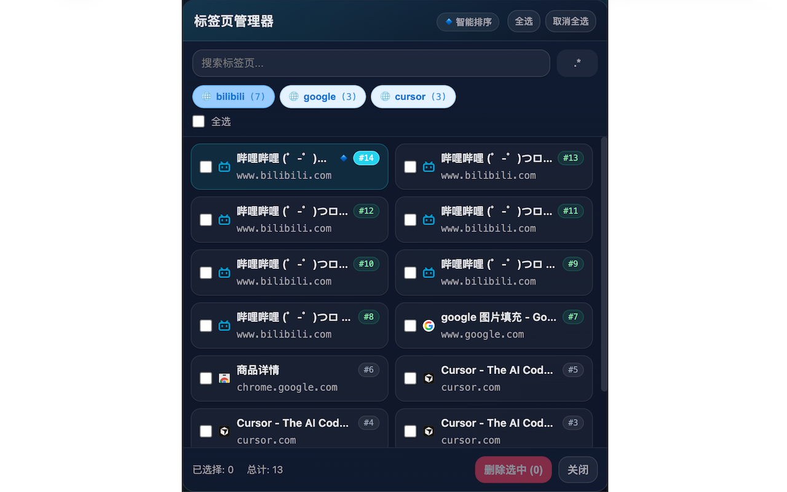
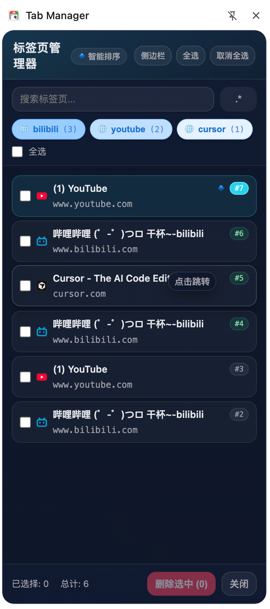

# Tab Manager - 标签页管理器（Chrome 扩展）



**侧边栏模式**



## 这是什么

Tab Manager 是一个用于**快速查看、筛选、批量关闭**浏览器标签页的扩展，并支持在**侧边栏常驻**打开，方便你在浏览网页时随手整理标签页。

- **Chrome Web Store**：[`https://chromewebstore.google.com/detail/iodkllilcebomffdnfakfmneenhfnplm`](https://chromewebstore.google.com/detail/iodkllilcebomffdnfakfmneenhfnplm?utm_source=item-share-cb)

## 功能一览

- **侧边栏打开（常驻）**：点击“侧边栏”按钮后在侧边栏展示，并自动关闭弹窗主界面；若浏览器不支持 Side Panel，会自动降级为“常驻窗口版”。
- **实时刷新**：侧边栏/常驻窗口会监听标签页的新增、关闭、标题/URL 变化、切换等事件，列表自动更新。
- **标签页列表**：展示所有可管理的标签页（自动排除 `chrome://` 等系统页面）。
- **快速搜索**：按标题/URL 实时过滤。
- **正则搜索**：点击搜索框旁 `.*` 切换正则模式；正则无效时会自动回退到普通搜索。
- **关键词聚合**：顶部自动生成“域名/标题关键词”快捷按钮，一键选中/取消选中一组相关标签页。
- **批量选择 & 批量关闭**：支持单选、多选、全选、取消全选；点击“删除选中”一键关闭多个标签页。
- **长按拖动排序（同步浏览器标签顺序）**：
  - **长按约 280ms** 进入拖拽，松开后会真实调用 `chrome.tabs.move` 调整标签页顺序
  - **多选拖拽**：长按的是“已选中项”时，会把**同窗口内的所有选中项作为整体**一起移动（保持它们的相对顺序）
  - 为了保证顺序计算准确：**搜索框有内容时会禁用拖拽**（提示清空搜索后再拖）
- **快捷键（界面内）**：
  - `Ctrl/Cmd + A`：全选
  - `Ctrl/Cmd + R`：切换正则模式
  - `Delete`：删除选中
  - `Escape`：关闭

## 安装（开发者模式）

1. 下载或克隆本项目到本地
2. 打开 Chrome：`chrome://extensions/`
3. 开启右上角“开发者模式”
4. 点击“加载已解压的扩展程序”，选择本项目目录

## 使用小贴士

- **想常驻使用**：点一次“侧边栏”，之后就可以在侧边栏里随时整理标签页。
- **想快速整理同类标签页**：用顶部关键词按钮先批量选中，再点“删除选中”。
- **想调整标签顺序**：清空搜索框后长按拖动；多选后长按选中项可整体移动。

## 文件结构

```
tabManager/
├── manifest.json      # 扩展配置
├── background.js      # 后台服务工作者
├── popup.html         # UI
├── popup.css          # 样式
├── popup.js           # 主要逻辑
├── icons/             # 图标
├── images/            # README 截图
└── README.md
```

## 权限说明

- `tabs` / `activeTab`：读取、激活、移动与关闭标签页
- `windows`：聚焦窗口、创建常驻窗口
- `sidePanel`：在侧边栏中打开扩展 UI

## 注意事项

- “删除选中”会直接关闭标签页，**不可撤销**。
- 拖拽排序默认只在**同一窗口**内生效。

## 许可证

MIT License

## 一句话总结

一个能在侧边栏实时管理标签页、支持批量关闭与（多选）长按拖拽排序的 Tab Manager。